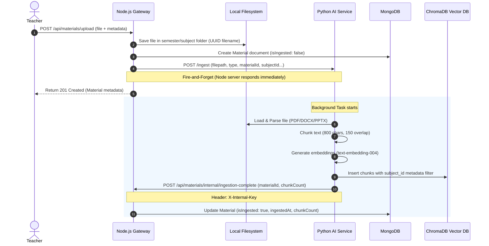
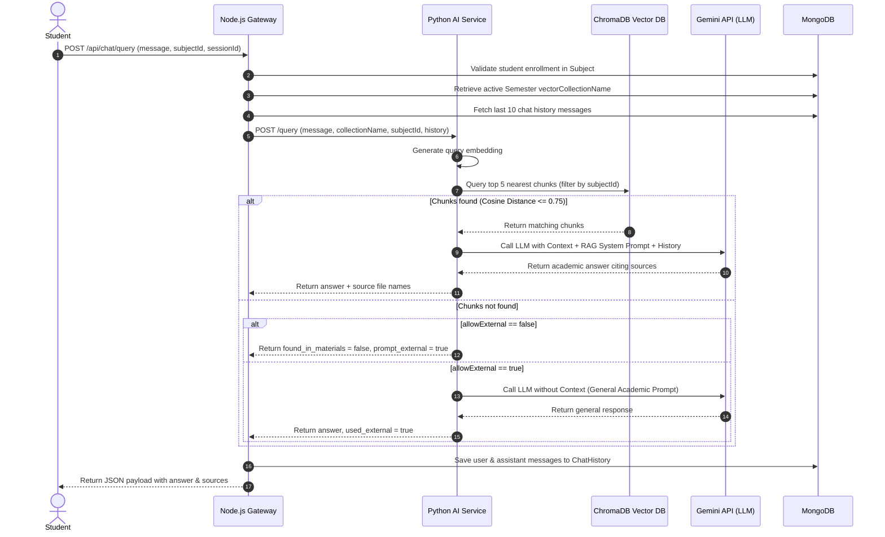

# OmniCampus — Backend System Architecture

This document details the architectural layers, system design, data flows, and security measures of the OmniCampus backend.

---

## 1. High-Level Architecture

OmniCampus is designed with a **decoupled, microservice-based architecture**. The primary backend handles the business domain and acts as a gateway, while a specialized microservice performs heavy-lifting AI, parsing, and vector search operations.

```
┌─────────────────────────────────────────────────────────────────────────┐
│                           Client (React App)                            │
└────────────────────────────────────┬────────────────────────────────────┘
                                     │ (HTTPS)
                                     ▼
┌─────────────────────────────────────────────────────────────────────────┐
│                    Primary Node.js (Express Server)                     │
│                                                                         │
│  - Authentication & JWT Issue / Refresh                                 │
│  - MongoDB & Mongoose Schemas (Metadata & Relations)                    │
│  - File System Storage of course documents                              │
│  - Orchestration of AI pipeline flows                                    │
└────────────────────────────────────┬────────────────────────────────────┘
                                     │ (Internal HTTP with HMAC/Key Check)
                                     ▼
┌─────────────────────────────────────────────────────────────────────────┐
│                        Python AI Service (FastAPI)                      │
│                                                                         │
│  - PDF/DOCX/PPTX text parsers                                           │
│  - Recursive character text splitters (langchain-text-splitters)        │
│  - Google embedding generator (text-embedding-004)                      │
│  - ChromaDB persistent storage                                          │
│  - Gemini LLM generation (gemini-1.5-flash)                             │
└─────────────────────────────────────────────────────────────────────────┘
```

---

## 2. Component Directory Structure

- **`node-server/`**:
  - `src/config/`: Contains MongoDB connection setup (`db.js`) and environment validation (`env.js`).
  - `src/models/`: Declares database schemas (`User`, `Semester`, `Subject`, `Material`, `Announcement`, `ChatHistory`).
  - `src/middleware/`: Secures endpoints (`auth.js`, `roleGuard.js`), validates uploads (`upload.js`), and normalizes errors (`errorHandler.js`).
  - `src/controllers/`: Houses the controller handlers coordinating database access and calling third-party APIs.
  - `src/routes/`: Registers path structures mapping HTTP verbs to controllers.
  - `src/services/`: Implements integrations for `email` (Nodemailer) and `aiProxy` (axios client communicating with the FastAPI microservice).

- **`python-ai-service/`**:
  - `app/models/schemas.py`: Pydantic models for incoming request bodies.
  - `app/services/parser.py`: Code utilizing `pdfplumber`, `python-docx`, and `python-pptx` to convert document files into clean plain text.
  - `app/services/embedder.py`: Handles connection to Google's GenAI embedding engine with batching support.
  - `app/services/vectorstore.py`: Wraps standard ChromaDB operations (creation, upsert, filters, deletion, query).
  - `app/services/llm.py`: Connects with the Google Gemini API to structure conversational context and generate RAG responses.
  - `app/routers/`: Routes for ingestion (`ingest.py`) and vector database query operations (`query.py`).

---

## 3. Key Data Flows

### A. Document Ingestion Pipeline (Asynchronous)

When a teacher uploads a course document:



---

### B. Retrieval-Augmented Generation (RAG) Query Flow

When a student asks the chatbot a question:



---

## 4. Security Framework

1. **Authentication**: Endpoints are protected by JSON Web Tokens (JWT). We implement a secure **short-lived Access Token** (15 minutes) and **long-lived Refresh Token** (7 days) schema. Refresh tokens are hashed using SHA-256 before being saved to the database.
2. **Authorization**: `roleGuard` middleware restricts access to administrative features (such as creating subjects, semesters, or uploading documents) exclusively to verified teachers.
3. **Internal Callback Security**: The critical endpoint `POST /api/materials/internal/ingestion-complete` is protected via a shared secret header `X-Internal-Key`. External callers cannot update the status of course materials.
4. **Input Sanitation & Injection Protection**:
   - `express-mongo-sanitize` scrubs user inputs to block NoSQL Injection attacks.
   - `helmet` configures security headers (e.g. X-Content-Type-Options, Content-Security-Policy).
   - `express-rate-limit` throttles login and registration attempts to a maximum of 10 requests per 15 minutes per IP address.
5. **Magic Bytes Validation**: Node server uses `multer` file filters to check incoming file formats strictly by MIME types, and file sizes are kept under 50MB.
