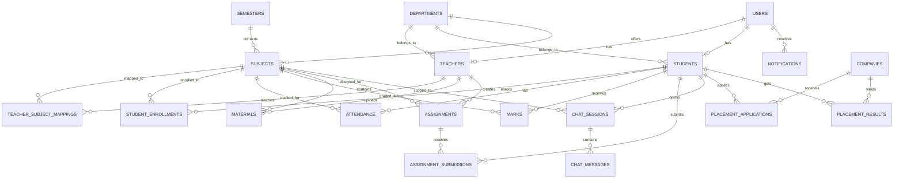
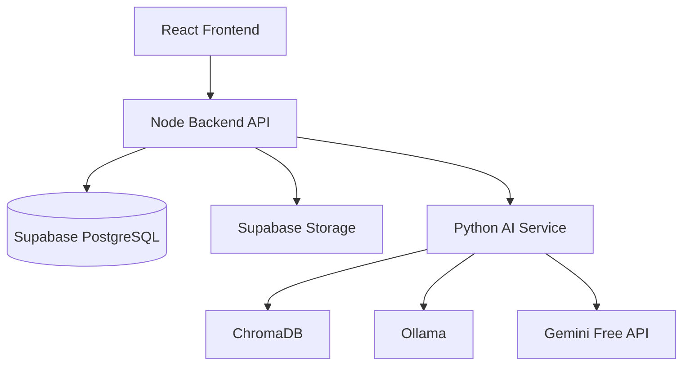

# OmniCampus Production ERP Report

## Scope
This repository has been moved from a MongoDB-oriented backend to a Supabase PostgreSQL-first ERP architecture.

The active runtime path is now:

- React frontend
- Node backend API
- Supabase PostgreSQL for relational data
- Supabase Storage for files
- ChromaDB via the Python AI service for embeddings and retrieval

Legacy resume-analysis routes and models were removed from the backend entry path.

## Database Schema
The complete schema is implemented in [supabase/schema.sql](../supabase/schema.sql).

Core tables:

- `users`
- `departments`
- `semesters`
- `subjects`
- `teachers`
- `students`
- `teacher_subject_mappings`
- `student_enrollments`
- `attendance`
- `marks`
- `materials`
- `assignments`
- `assignment_submissions`
- `companies`
- `placement_applications`
- `placement_results`
- `events`
- `event_registrations`
- `notifications`
- `chat_sessions`
- `chat_messages`
- `interview_experiences`
- `placement_records`
- `refresh_tokens`
- `password_reset_tokens`
- `audit_logs`

## Primary Keys
All core tables use UUID primary keys.

Examples:

- `users.user_id`
- `students.student_id`
- `subjects.subject_id`
- `materials.material_id`
- `chat_sessions.session_id`

## Foreign Keys
Key relationships:

- `teachers.user_id -> users.user_id`
- `students.user_id -> users.user_id`
- `subjects.department_id -> departments.department_id`
- `subjects.semester_id -> semesters.semester_id`
- `teacher_subject_mappings.teacher_id -> teachers.teacher_id`
- `teacher_subject_mappings.subject_id -> subjects.subject_id`
- `student_enrollments.student_id -> students.student_id`
- `student_enrollments.subject_id -> subjects.subject_id`
- `materials.subject_id -> subjects.subject_id`
- `materials.semester_id -> semesters.semester_id`
- `assignment_submissions.assignment_id -> assignments.assignment_id`
- `assignment_submissions.student_id -> students.student_id`
- `chat_messages.session_id -> chat_sessions.session_id`
- `notifications.user_id -> users.user_id`

## Indexes
Important indexes defined in the schema:

- `subjects(department_id, semester_id)`
- `students(department_id, semester_id)`
- `student_enrollments(student_id)`
- `attendance(student_id, subject_id, attendance_date)`
- `marks(student_id, subject_id)`
- `materials(subject_id, uploaded_at)`
- `assignments(subject_id, due_date)`
- `assignment_submissions(assignment_id, student_id)`
- `notifications(user_id, is_read, created_at)`
- `chat_sessions(student_id, subject_id, last_active)`
- `chat_messages(session_id, created_at)`

## Row Level Security
RLS is enabled on the core tables, with policies for:

- self-access to user and student/teacher profiles
- owner access for notifications and chat sessions/messages
- service-role access for backend API operations

## ERP Relationships

## Runtime Architecture

## API Surface
The new router in [src/routes/erp.routes.js](../node-server/src/routes/erp.routes.js) serves the frontend contract.

### Auth
- `POST /api/auth/register`
- `POST /api/auth/login`
- `POST /api/auth/refresh-token`
- `POST /api/auth/logout`
- `GET /api/auth/me`
- `POST /api/auth/forgot-password`
- `POST /api/auth/reset-password`
- `GET /api/auth/verify-email`

### Academics
- `GET /api/semesters`
- `POST /api/semesters`
- `GET /api/subjects`
- `POST /api/subjects`
- `GET /api/student/subjects`
- `GET /api/teacher/subjects`
- `GET /api/teacher/students`
- `GET /api/subjects/:subjectId/students`

### Materials and AI
- `GET /api/materials`
- `POST /api/materials/upload`
- `GET /api/chat/history`
- `GET /api/chat/session/:sessionId`
- `POST /api/chat/session`
- `POST /api/chat/query`

### Attendance and Marks
- `GET /api/student/attendance`
- `POST /api/teacher/attendance`
- `GET /api/student/marks`
- `POST /api/teacher/marks`

### Assignments
- `GET /api/assignments/student`
- `GET /api/assignments/teacher`
- `POST /api/assignments`
- `POST /api/assignments/:assignmentId/submit`
- `GET /api/assignments/:assignmentId/submissions`
- `POST /api/assignments/submissions/:submissionId/grade`

### Placement
- `GET /api/placement/companies`
- `POST /api/placement/companies`
- `GET /api/placement/dashboard`
- `POST /api/placement/records`
- `GET /api/placement/companies/:companyId/experiences`
- `POST /api/placement/companies/:companyId/experiences`

### Admin and Notifications
- `GET /api/admin/analytics`
- `GET /api/admin/users`
- `POST /api/admin/users`
- `DELETE /api/admin/users/:userId`
- `GET /api/notifications`
- `PATCH /api/notifications/:notificationId/read`
- `PATCH /api/notifications/read-all`

### Events and Health
- `GET /api/events`
- `POST /api/events`
- `GET /api/health`

## Folder Structure
Current backend layout:

- `node-server/src/app.js`
- `node-server/src/config/env.js`
- `node-server/src/config/db.js`
- `node-server/src/routes/erp.routes.js`
- `node-server/src/services/aiGateway.service.js`
- `node-server/src/services/aiProxy.service.js`
- `node-server/src/middleware/auth.js`
- `node-server/src/middleware/roleGuard.js`
- `node-server/src/middleware/upload.js`

Frontend cleanup touched:

- `src/pages/StudentDashboard.js`
- `src/pages/AdminDashboard.js`
- `src/pages/TpoDashboard.js`
- `src/pages/TeacherDashboard.js`
- `src/pages/SignIn.js`

## Migration Steps
1. Apply `supabase/schema.sql` to a Supabase project.
2. Create the `academic-materials` storage bucket, or set `SUPABASE_STORAGE_BUCKET` to the bucket name you want.
3. Add backend environment variables:
   - `SUPABASE_URL`
   - `SUPABASE_ANON_KEY`
   - `SUPABASE_SERVICE_ROLE_KEY`
   - `JWT_ACCESS_SECRET`
   - `JWT_REFRESH_SECRET`
   - `AI_SERVICE_URL`
4. Seed base reference data such as departments and semesters.
5. Create admin, teacher, and student users through the new API.
6. Upload materials so ChromaDB collections are populated by the AI ingestion service.
7. Verify chat sessions are created per student and subject.

## Testing Report
Validation performed in this workspace:

- backend syntax check passed for the rewritten config, route, and schema files
- frontend syntax check passed for the dashboard and sign-in cleanup
- resume backend files were removed from the runtime path
- seeded resume analyzer UI was removed from the student portal
- seeded dashboard defaults were replaced with empty-state or database-driven values

No runtime Supabase connection was executed here because the workspace does not include production credentials.

## Hardcoded Data Check
The active UI and backend path no longer depend on the removed resume demo data or MongoDB seed flow. The main dashboards now read from the API, and the remaining visible placeholder text is empty-state copy rather than seeded record data.
